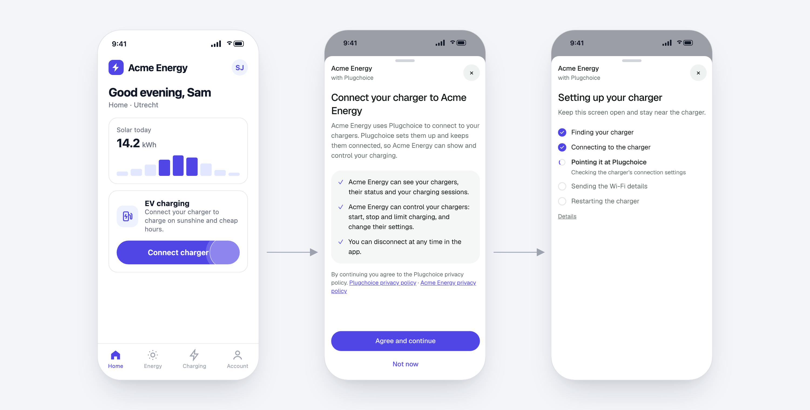

<a href="https://developer.plugchoice.com/sdk">
  <picture>
    <source media="(prefers-color-scheme: dark)" srcset="assets/plugchoice-logo-white.svg">
    
  </picture>
</a>

# Plugchoice Mobile SDK

 

Let the people using your app connect their EV chargers to Plugchoice, without leaving your app. The SDK opens Plugchoice's guided setup in your iOS, Android or React Native app and takes care of what only a phone can do: Wi-Fi hotspots, the local network and Bluetooth.

**[Documentation](https://developer.plugchoice.com/sdk)** · [API reference](https://developer.plugchoice.com/sdk/api)

## Features

- **Charger setup**: add a charger, set it up, or reconnect it (which also changes its network, such as its Wi-Fi), guided screen by screen.
- **Many brands, no app update**: new charger brands and fixes reach your users without a new release of your app.
- **One backend endpoint**: your server creates a session, scoped to the chargers your user may touch; the SDK fetches it when it needs one.
- **Native where it counts**: Wi-Fi hotspots, local network discovery, Bluetooth LE and QR scanning, behind each platform's own permission prompts.
- **Your look**: your logo and colours, in light and dark mode, in 7 languages.

## Installation

| Platform | Package | Requirements |
|---|---|---|
| iOS | Swift Package Manager: `https://github.com/plugchoice/mobile-sdk`, library `PlugchoiceSDK` | iOS 16+ |
| Android | `com.plugchoice:plugchoice` | Android 10 (API 29)+ |
| React Native / Expo | `@plugchoice/react-native` | Expo SDK 57+ |

See the [installation guide](https://developer.plugchoice.com/sdk/install) for each platform.

## Getting started

Follow the [integration guide](https://developer.plugchoice.com/sdk/get-started). Example apps are in [`ios/Example`](ios/Example) and [`android/example`](android/example).

## Security

Email security issues to [security@plugchoice.com](mailto:security@plugchoice.com). See [SECURITY.md](SECURITY.md).

## License

See [LICENSE](LICENSE).
